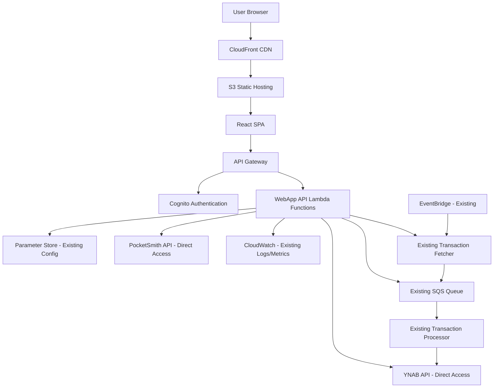

# Design Document

## Overview

The PocketSmith-YNAB Sync WebApp is a serverless React application hosted on AWS that provides a management interface for the existing PocketSmith-YNAB synchronization solution. The webapp integrates with the existing Python-based sync infrastructure while adding a user-friendly interface for configuration, monitoring, and manual sync operations.

## Architecture

### High-Level Architecture



### Technology Stack

**Frontend:**
- React 18 with TypeScript
- Material-UI (MUI) for responsive design
- React Query for API state management
- React Router for navigation
- Axios for HTTP requests

**Backend (New WebApp API):**
- AWS Lambda (Node.js 18.x runtime) for webapp-specific endpoints
- API Gateway for REST endpoints
- DynamoDB for webapp session/user data
- Integration with existing Python Lambda functions

**Existing Infrastructure (Reused):**
- Python Lambda functions (fetch_transactions.py, process_transactions.py)
- SQS Queue for transaction processing
- EventBridge for scheduled syncs
- Parameter Store for API keys and account mappings
- CloudWatch for logs and metrics

**Infrastructure:**
- AWS CDK for Infrastructure as Code
- CloudFront for global content delivery
- S3 for static asset hosting
- Cognito for authentication

## Components and Interfaces

### Frontend Components

#### 1. Authentication Components
- **LoginPage**: Cognito-integrated login form
- **AuthProvider**: Context provider for authentication state
- **ProtectedRoute**: Route wrapper requiring authentication

#### 2. Account Management Components
- **AccountMappingPage**: Main configuration interface
- **AccountSelector**: Dropdown for selecting PocketSmith/YNAB accounts
- **MappingCard**: Individual account mapping display/edit component
- **AccountList**: Displays available accounts from both APIs

#### 3. Sync Status Components
- **SyncStatusDashboard**: Overview of all sync operations
- **SyncHistoryTable**: Chronological sync operation log
- **StatusIndicator**: Visual status representation (success/error/in-progress)
- **ErrorDetails**: Expandable error message display

#### 4. Balance Comparison Components
- **BalanceComparisonTable**: Side-by-side balance display
- **DiscrepancyHighlight**: Visual indicator for balance differences
- **RefreshButton**: Manual balance refresh trigger
- **LastUpdatedIndicator**: Timestamp display for data freshness

#### 5. Sync Control Components
- **SyncTriggerButton**: Manual sync initiation
- **SyncProgressModal**: Real-time sync progress display
- **BulkSyncSelector**: Multi-account sync selection

### Backend API Endpoints

#### Authentication Endpoints
- `POST /auth/login` - Cognito authentication
- `POST /auth/refresh` - Token refresh
- `POST /auth/logout` - Session termination

#### Account Management Endpoints
- `GET /accounts/pocketsmith` - Fetch PocketSmith accounts using existing Parameter Store credentials
- `GET /accounts/ynab` - Fetch YNAB accounts using existing Parameter Store credentials
- `GET /mappings` - Get current account mappings from existing Parameter Store configuration
- `POST /mappings` - Update account mapping in existing Parameter Store format
- `DELETE /mappings/{id}` - Remove account mapping from Parameter Store

#### Sync Management Endpoints
- `GET /sync/status` - Get sync status from CloudWatch logs and SQS queue metrics
- `GET /sync/history` - Parse CloudWatch logs for sync operation history
- `POST /sync/trigger` - Invoke existing transaction fetcher Lambda function
- `GET /sync/progress/{syncId}` - Monitor SQS queue and CloudWatch logs for progress

#### Balance Comparison Endpoints
- `GET /balances/compare` - Fetch current balances from both PocketSmith and YNAB APIs
- `POST /balances/refresh` - Trigger fresh balance retrieval

#### Integration Endpoints (Existing System)
- **Existing Lambda Functions**: `dev-pocketsmith-transaction-fetcher`, `dev-pocketsmith-transaction-processor`
- **Existing SQS Queue**: Transaction processing queue
- **Existing Parameter Store**: `/pocketsmith-ynab-sync/pocketsmith-api-key`, `/pocketsmith-ynab-sync/ynab-api-key`, `/pocketsmith-ynab-sync/ynab-budget-id`, `/pocketsmith-ynab-sync/account-mapping`

## Data Models

### Account Mapping Model (Existing Parameter Store Format)
```typescript
// Existing Parameter Store format: /pocketsmith-ynab-sync/account-mapping
interface ExistingAccountMappingConfig {
  mappings: Record<string, string>; // PocketSmith ID -> YNAB ID
  default_account_id?: string;
  strict_mode: boolean;
  created_at?: string;
  auto_generated?: boolean;
}

// WebApp display format
interface AccountMappingDisplay {
  pocketsmithAccountId: string;
  pocketsmithAccountName: string;
  ynabAccountId: string;
  ynabAccountName: string;
  isActive: boolean;
}
```

### PocketSmith Account Model
```typescript
interface PocketSmithAccount {
  id: number;
  name: string;
  type: string;
  currency_code: string;
  current_balance: number;
  current_balance_date: string;
  current_balance_in_base_currency: number;
  safe_balance: number;
  safe_balance_in_base_currency: number;
  starting_balance: number;
  starting_balance_date: string;
  created_at: string;
  updated_at: string;
  institution?: {
    id: number;
    name: string;
  };
}
```

### YNAB Account Model
```typescript
interface YNABAccount {
  id: string;
  name: string;
  type: 'checking' | 'savings' | 'creditCard' | 'cash' | 'lineOfCredit' | 'otherAsset' | 'otherLiability' | 'mortgage';
  on_budget: boolean;
  closed: boolean;
  note?: string;
  balance: number;
  cleared_balance: number;
  uncleared_balance: number;
  transfer_payee_id: string;
  direct_import_linked: boolean;
  direct_import_in_error: boolean;
  last_reconciled_at?: string;
  debt_original_balance?: number;
  debt_interest_rates?: any;
  debt_minimum_payments?: any;
  debt_escrow_amounts?: any;
}
```

### Sync Status Model (Derived from CloudWatch Logs)
```typescript
interface SyncStatus {
  lastSyncTime?: string;
  status: 'idle' | 'running' | 'completed' | 'failed';
  transactionsProcessed: number;
  transactionsFailed: number;
  duplicatesSkipped: number;
  errorMessage?: string;
  nextScheduledSync?: string;
  queueDepth: number; // From SQS metrics
}
```

### Sync History Model (Parsed from CloudWatch Logs)
```typescript
interface SyncHistoryEntry {
  timestamp: string;
  requestId: string;
  status: 'success' | 'failed' | 'partial';
  transactionsFetched: number;
  transactionsProcessed: number;
  transactionsFailed: number;
  duplicatesSkipped: number;
  duration: number;
  errorDetails?: string[];
}
```

### Balance Comparison Model
```typescript
interface BalanceComparison {
  pocketsmithAccountId: string;
  pocketsmithAccountName: string;
  pocketsmithBalance: number;
  ynabAccountId: string;
  ynabAccountName: string;
  ynabBalance: number;
  difference: number;
  currency: string;
  lastUpdated: string;
  hasDiscrepancy: boolean;
  discrepancyThreshold: number; // e.g., 0.01 for 1 cent
}
```

## Error Handling

### Frontend Error Handling
- **Network Errors**: Retry mechanism with exponential backoff
- **Authentication Errors**: Automatic redirect to login
- **API Errors**: User-friendly error messages with action suggestions
- **Validation Errors**: Real-time form validation with clear feedback

### Backend Error Handling
- **API Rate Limiting**: Implement exponential backoff for external API calls
- **Credential Validation**: Validate API keys before storing
- **Data Consistency**: Transaction-like operations for critical data updates
- **Monitoring**: CloudWatch logs and metrics for error tracking

### Error Response Format
```typescript
interface ErrorResponse {
  error: {
    code: string;
    message: string;
    details?: any;
    timestamp: string;
  };
}
```

## Testing Strategy

### Frontend Testing
- **Unit Tests**: Jest + React Testing Library for component testing
- **Integration Tests**: API integration testing with mock backends
- **E2E Tests**: Cypress for critical user flows
- **Accessibility Tests**: axe-core integration for WCAG compliance

### Backend Testing
- **Unit Tests**: Jest for Lambda function testing
- **Integration Tests**: LocalStack for AWS service testing
- **API Tests**: Supertest for endpoint testing
- **Load Tests**: Artillery for performance testing

### Test Coverage Requirements
- Minimum 80% code coverage for both frontend and backend
- 100% coverage for critical paths (authentication, sync operations)
- Automated testing in CI/CD pipeline

## Security Considerations

### Authentication & Authorization
- AWS Cognito for user management
- JWT tokens for API authentication
- Role-based access control (future enhancement)

### Data Protection
- API keys encrypted using AWS KMS
- HTTPS enforcement for all communications
- Secure session management with automatic expiration

### Infrastructure Security
- VPC configuration for Lambda functions
- IAM roles with least privilege principle
- CloudTrail logging for audit trails
- WAF protection for API Gateway

## Performance Optimization

### Frontend Performance
- Code splitting for reduced initial bundle size
- React.memo for component optimization
- Lazy loading for non-critical components
- Service worker for offline capability (future enhancement)

### Backend Performance
- Lambda function warming strategies
- DynamoDB query optimization with proper indexing
- API response caching where appropriate
- Connection pooling for external API calls

### Monitoring & Observability
- CloudWatch dashboards for key metrics
- X-Ray tracing for request flow analysis
- Custom metrics for business logic monitoring
- Alerting for critical failures and performance degradation